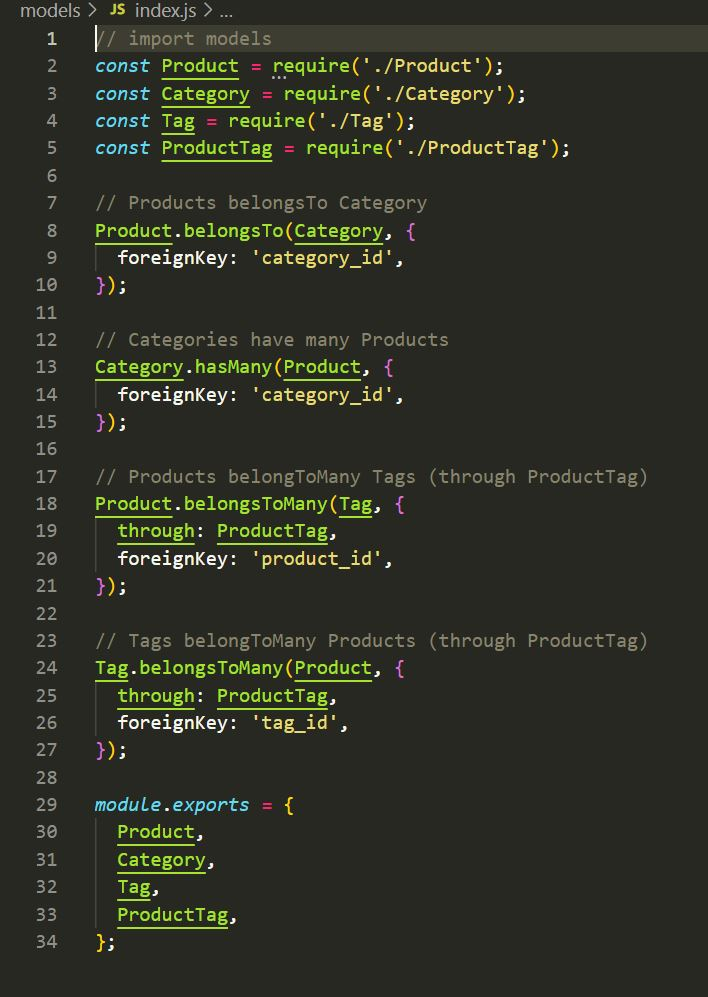

# ORM_ecom
- Back end for a e-commerce website. Here we can create categories and add products or tags to products. This creates a more or less inventory for a store. 

## General Information
- ECOM back end
- Can be used as a sort of Inventory system.
- Has three different sections that are updatable and you can add to.

## Features
- You can add a category of your choosing EX: Food
- You can add products to a category EX Meats --> Food
- You can add Tags to Products so you can search based off tags EX: Red -> Meats

## Screenshots / Links
[ECOM_project.webm](https://github.com/TristanM225/ORM_ecom/assets/126945628/2307cce3-a753-4038-9392-5a4858c815a8)

- Link to github
https://github.com/TristanM225/ORM_ecom

## Setup
- npm I
- SOURCE schema.sql
- npm run seed
- npm run start

## Usage
- Create a almost inventory like system 
- Create a back end for a ECOM

## Project Status
Project is: _complete_ 

## Room for Improvement
Include areas you believe need improvement / could be improved. Also add TODOs for future development.

Room for improvement:
- Styling
- Cleaning up text / removing unneccessary code

## Credit / Acknowledgements 
Took ideas from UCSD coding boot camp folder. 
Also watched a lot of the zoom office hours. Big Thanks to oswaldo for asking questions.
Big Thanks to Micheal, Nirav and Julius for helping answer any questions

## Contact
Created by TristanM225 Reach out to me by email! TristanM225@gmail.com

